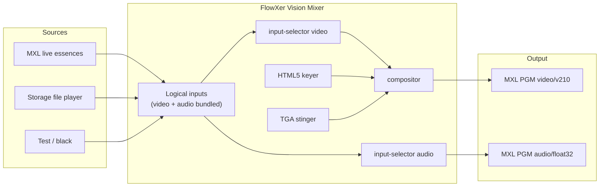

# FlowXer

DMF **Vision Mixer** microservice for the [EBU Dynamic Media Facility](https://tech.ebu.ch/dmf/ra) Media eXchange Layer ([dmf-mxl/mxl](https://github.com/dmf-mxl/mxl)).

The mixer is controlled over HTTP, publishes **OpenAPI** at `/docs`, and keeps media **uncompressed** on the MXL domain:

| Essence | MXL media type | GStreamer caps |
|---------|----------------|----------------|
| Video (VP210 / v210) | `video/v210` | `video/x-raw,format=v210` |
| Audio | `audio/float32` | `audio/x-raw,format=F32LE,rate=48000` |

Architecture follows [MXL hands-on Exercise 4](https://github.com/cbcrc/mxl-hands-on/blob/main/Exercises/Exercise4.md): FastAPI control plane, GStreamer media plane, logical sources, HTML5 keyer, file player, and MXL `mxlsrc` / `mxlsink` when the SDK plugin is present.



## What it does

- **Logical inputs** virtually bundle a video essence and an audio essence into one mixer source (camera, clip, replay, test, black).
- **Storage access** plays files from `storage/clips` (`.mp4`, `.ts`, `.mov`, `.mxf`, …) as uncompressed v210 + float32.
- **HTML5 graphics overlay** keys a page over program (`cefsrc` when installed, Pillow fallback otherwise). A sample lower-third is served at `/graphics/lower-third.html`.
- **Replay stinger** plays a **TGA sequence with alpha**. At the fully opaque frame the mixer cuts program to replay (or back to live), then finishes the sequence.
- Runs in a **Docker** container with a shared MXL domain volume.

## API

| | |
|--|--|
| Control surface | http://localhost:9610 |
| Swagger UI | http://localhost:9610/docs |
| ReDoc | http://localhost:9610/redoc |
| OpenAPI JSON | http://localhost:9610/openapi.json |

Useful calls:

```bash
# Start the mixer (publishes deterministic PGM flow UUIDs)
curl -X POST http://localhost:9610/api/v1/mixer/start \
  -H 'content-type: application/json' \
  -d '{"program_input_id":"cam-1","overlay_enabled":true}'

# Bundle a live MXL camera as one logical input
curl -X POST http://localhost:9610/api/v1/inputs \
  -H 'content-type: application/json' \
  -d '{
    "id":"studio-a",
    "label":"Studio A",
    "kind":"mxl_live",
    "video":{"flow_id":"5fbec3b1-1b0f-417d-9059-8b94a47197ed","media_type":"video/v210"},
    "audio":{"flow_id":"b3bb5be7-9fe9-4324-a5bb-4c70e1084449","media_type":"audio/float32","channels":2}
  }'

# Load a clip and stinger into replay, then return to live
curl -X POST http://localhost:9610/api/v1/replay/load \
  -H 'content-type: application/json' -d '{"file_path":"sizzle.ts"}'
curl -X POST http://localhost:9610/api/v1/replay/take \
  -H 'content-type: application/json' -d '{"stinger_id":"replay-wipe"}'
curl -X POST http://localhost:9610/api/v1/replay/return \
  -H 'content-type: application/json' -d '{"stinger_id":"replay-wipe"}'
```

Register live MXL inputs **before** starting the mixer. Essence `media_type` is constrained to `video/v210` (or `video/v210a`) and `audio/float32`.

## Docker

```bash
mkdir -p storage/clips
# optional: copy a clip next to the mixer
# cp /path/to/sizzle.ts storage/clips/

docker compose up --build
```

The container:

- serves the API and operator panel on port **9610**
- mounts a tmpfs MXL domain at `/mxl-domain`
- bind-mounts `./storage` for clips, generated TGA stingers, and overlay PNG cache
- uses GStreamer (`videotestsrc`, `input-selector`, `compositor`, `multifilesrc`, `videoconvert` → **v210** / **F32LE**)

### Real MXL I/O

Build or copy the [MXL SDK](https://github.com/dmf-mxl/mxl) GStreamer plugin (`libgstmxl.so` + `libmxl.so`) into `/opt/mxl` and the mixer will switch `fakesink` for `mxlsink` / `mxlsrc` automatically. That is the same plugin used by the Exercise 4 portable apps (`test-generator`, `file-player`, `html5-keyer`).

You can share one domain with those apps by pointing `FLOWXER_MXL_DOMAIN` at the same host directory they use (for example `/Volumes/mxl/domain_1`).

HTML5 keying in production uses [`gstcefsrc`](https://github.com/centricular/gstcefsrc). Without it, FlowXer still keys a generated lower-third PNG and will load any URL you set once `cefsrc` is on `GST_PLUGIN_PATH`.

## Local development

```bash
python3 -m venv .venv
source .venv/bin/activate
pip install -e '.[dev]'
pytest
FLOWXER_SIMULATE=true FLOWXER_STORAGE_ROOT=./storage FLOWXER_MXL_DOMAIN=./data/mxl-domain \
  uvicorn flowxer.app:create_app --factory --port 9610
```

## Stinger convention

Place sequences under `storage/stingers/<id>/`:

```
frame_00000.tga
frame_00001.tga
...
stinger.json   # { "frame_count", "cut_frame", "pattern": "frame_%05d.tga" }
```

`cut_frame` is the first fully opaque frame — that is when program switches from live to replay (or back). Generate the bundled wipe with:

```bash
python scripts/generate_stinger.py --dest storage/stingers/replay-wipe
```

## License

Apache-2.0. MXL is Apache-2.0; GStreamer plugins remain under their upstream licenses.
