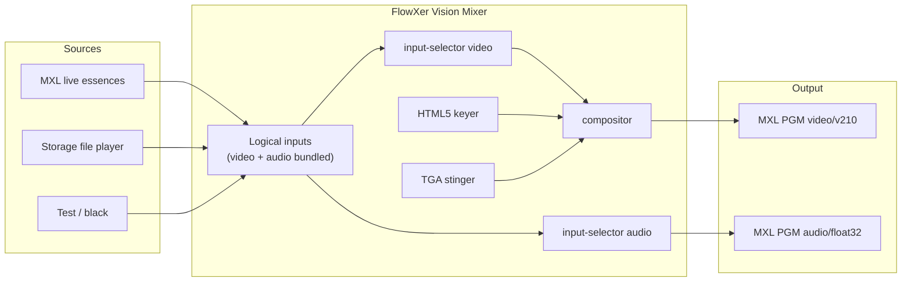

# FlowXer

DMF **Vision Mixer** microservice for the [EBU Dynamic Media Facility](https://tech.ebu.ch/dmf/ra) Media eXchange Layer ([dmf-mxl/mxl](https://github.com/dmf-mxl/mxl)).

The mixer is controlled over HTTP, publishes **OpenAPI** at `/docs`, and keeps media **uncompressed** on the MXL domain:

| Essence | MXL media type | GStreamer caps |
|---------|----------------|----------------|
| Video (VP210 / v210) | `video/v210` | `video/x-raw,format=v210` |
| Audio | `audio/float32` | `audio/x-raw,format=F32LE,rate=48000` |

Architecture follows [MXL hands-on Exercise 4](https://github.com/cbcrc/mxl-hands-on/blob/main/Exercises/Exercise4.md): FastAPI control plane, GStreamer media plane, logical sources, HTML5 keyer, file player, and MXL `mxlsrc` / `mxlsink` when the SDK plugin is present.



## What it does

- **Logical inputs** virtually bundle a video essence and an audio essence into one mixer source (camera, clip, replay, test, black).
- **Storage access** plays files from `storage/clips` (`.mp4`, `.ts`, `.mov`, `.mxf`, …) as uncompressed v210 + float32.
- **HTML5 graphics overlay** keys a page over program (`cefsrc` when installed, Pillow fallback otherwise). A sample lower-third is served at `/graphics/lower-third.html`.
- **Replay stinger** plays a **TGA sequence with alpha**. At the fully opaque frame the mixer cuts program to replay (or back to live), then finishes the sequence.
- Runs in **Docker** (`vision-mixer` + `gui` services) with a shared MXL domain volume.

## Operator GUI

The GUI is a **separate React service** (Vite + TypeScript) so the mixer container stays a media function. It talks to the mixer API and shows live pictures over **WebRTC WHEP** (JPEG snapshots if WebRTC is unavailable).

```
┌─ File  Settings  Help ──────── CPU · RAM · raster · issues ─┐
│  PREVIEW (WebRTC)          PROGRAM (WebRTC)                 │
│  DSK 1  Stinger IN/OUT                                      │
│                                                             │
│  [Name ⚙] [Name ⚙] …   logical sources along the bottom     │
│  left click picture = PVW · right click picture = PGM       │
└─────────────────────────────────────────────────────────────┘
```

**Settings** (classic menu) configure:

- video format (1080p50, 720p50, 2160p50, … uncompressed v210)
- how many logical sources
- how many mixer panels (MEs)
- stingers: same TGA for in and out, or separate in/out, and how many
- how many downstream keyers for HTML5 graphics

The gear on each source opens source-specific setup (name, kind, MXL flow UUIDs, clip).

| | |
|--|--|
| Operator GUI | http://localhost:9620 |
| Mixer API / OpenAPI | http://localhost:9610/docs |

```bash
cd gui && npm install && npm run dev   # proxies /api to :9610
```

## API

| | |
|--|--|
| Operator GUI | http://localhost:9620 |
| Mixer landing | http://localhost:9610 |
| Swagger UI | http://localhost:9610/docs |
| ReDoc | http://localhost:9610/redoc |
| OpenAPI JSON | http://localhost:9610/openapi.json |

Useful calls:

```bash
# Start the mixer (publishes deterministic PGM flow UUIDs)
curl -X POST http://localhost:9610/api/v1/mixer/start \
  -H 'content-type: application/json' \
  -d '{"program_input_id":"cam-1","overlay_enabled":true}'

# Bundle a live MXL camera as one logical input
curl -X POST http://localhost:9610/api/v1/inputs \
  -H 'content-type: application/json' \
  -d '{
    "id":"studio-a",
    "label":"Studio A",
    "kind":"mxl_live",
    "video":{"flow_id":"5fbec3b1-1b0f-417d-9059-8b94a47197ed","media_type":"video/v210"},
    "audio":{"flow_id":"b3bb5be7-9fe9-4324-a5bb-4c70e1084449","media_type":"audio/float32","channels":2}
  }'

# Load a clip and stinger into replay, then return to live
curl -X POST http://localhost:9610/api/v1/replay/load \
  -H 'content-type: application/json' -d '{"file_path":"sizzle.ts"}'
curl -X POST http://localhost:9610/api/v1/replay/take \
  -H 'content-type: application/json' -d '{"stinger_id":"replay-wipe"}'
curl -X POST http://localhost:9610/api/v1/replay/return \
  -H 'content-type: application/json' -d '{"stinger_id":"replay-wipe"}'
```

Register live MXL inputs **before** starting the mixer. Essence `media_type` is constrained to `video/v210` (or `video/v210a`) and `audio/float32`.

## Docker

```bash
mkdir -p storage/clips
# optional: copy a clip next to the mixer
# cp /path/to/sizzle.ts storage/clips/

docker compose up --build
```

Services:

- **gui** on port **9620** — operator console (WebRTC monitors, PVW/PGM, settings)
- **vision-mixer** on port **9610** — control API, OpenAPI, WHEP previews
- tmpfs MXL domain at `/mxl-domain`
- bind-mount `./storage` for clips, TGA stingers, overlay cache
- GStreamer path: `videotestsrc` / `filesrc` → `input-selector` → compositor → **v210** / **F32LE**

### Real MXL I/O

Build or copy the [MXL SDK](https://github.com/dmf-mxl/mxl) GStreamer plugin (`libgstmxl.so` + `libmxl.so`) into `/opt/mxl` and the mixer will switch `fakesink` for `mxlsink` / `mxlsrc` automatically. That is the same plugin used by the Exercise 4 portable apps (`test-generator`, `file-player`, `html5-keyer`).

You can share one domain with those apps by pointing `FLOWXER_MXL_DOMAIN` at the same host directory they use (for example `/Volumes/mxl/domain_1`).

HTML5 keying in production uses [`gstcefsrc`](https://github.com/centricular/gstcefsrc). Without it, FlowXer still keys a generated lower-third PNG and will load any URL you set once `cefsrc` is on `GST_PLUGIN_PATH`.

## Local development

```bash
python3 -m venv .venv
source .venv/bin/activate
pip install -e '.[dev]'
pytest
FLOWXER_SIMULATE=true FLOWXER_STORAGE_ROOT=./storage FLOWXER_MXL_DOMAIN=./data/mxl-domain \
  uvicorn flowxer.app:create_app --factory --port 9610
```

## Stinger convention

Each stinger slot can use a **TGA sequence** or a **video file**, and has a **cut time** — the moment program switches while the sting covers the picture.

Place sequences under `storage/stingers/<id>/`:

```
frame_00000.tga
frame_00001.tga
...
stinger.json   # { "kind": "sequence", "frame_count", "cut_frame", "cut_ms", "pattern": "frame_%05d.tga" }
```

Video stingers live in the same tree (`kind: "video"` plus `media_path`). In the GUI, open the stinger ⚙: pick Sequence or Video, then set **Cut at (seconds)**.

`cut_ms` / `cut_frame` is when program switches from live to replay (or back). Generate the bundled wipe with:

```bash
python scripts/generate_stinger.py --dest storage/stingers/replay-wipe
```

## License

Apache-2.0. MXL is Apache-2.0; GStreamer plugins remain under their upstream licenses.

## Branches and releases

FlowXer uses three long-lived branches. Version numbers are **(merges to main).(promotions to stage).(pushes to dev)** and live in `VERSION`.

```
dev  →  stage  →  main
code     test       container
```

| Branch | What you do | Automation |
|--------|-------------|------------|
| **dev** | Write code. Open PRs into `dev`. | Push increments the **patch** (code) counter. Tests run on the PR (`ci.yml`). |
| **stage** | Merge `dev` → `stage` when a slice is ready to verify. | Push increments the **minor** (stage) counter, runs pytest + typecheck, **builds containers without publishing**, and starts a **Cursor cloud agent** if `CURSOR_API_KEY` is set. Then merges `stage` back into `dev` so `VERSION` stays aligned. |
| **main** | **Manually** merge `stage` → `main` when you want a release. | Push increments the **major** (main) counter, tags `vX.Y.Z`, publishes `ghcr.io/<owner>/flowxer-vision-mixer` and `flowxer-gui`, then merges `main` → `stage` → `dev`. |

Example: `1.4.12` means 1 production release, 4 stage promotions, 12 coding pushes since the counters started.

Before bumping, each version job **reconciles** `VERSION` to the component-wise max of `origin/main`, `origin/stage`, and `origin/dev`, then increments the counter for that branch. That keeps the triple monotonic even if a branch was behind.

Do not merge `dev` straight to `main`. Stage is the test gate; main is the container release.

### Branch protection (required)

This repository has no GitHub branch protection yet. Configure it under **Settings → Rules → Rulesets** (or **Settings → Branches**) so the workflow cannot be skipped:

| Branch | Rules |
|--------|--------|
| **main** | Require a pull request. Require the `CI / Pytest` check. Do not allow force pushes or deletions. Restrict who can push to admins / the merge queue. |
| **stage** | Same as `main`. PRs should come from `dev`. |
| **dev** | Require a pull request. Require `CI / Pytest`. Do not allow force pushes or deletions. |

Without these rules, a direct push to `main` still publishes GHCR images.

### Cursor environment on stage

Cloud Agent setup lives in `.cursor/environment.json` (install script + mixer/GUI terminals). Commit that file; do not rely on a personal dashboard environment.

Two options for the **stage test agent** (pick one; both are valid):

1. **GitHub Actions secret `CURSOR_API_KEY`** — Settings → Secrets and variables → Actions. `stage.yml` calls `https://api.cursor.com/v1/agents` with `startingRef: stage`. Create the key at [cursor.com/dashboard](https://cursor.com/dashboard) → Integrations / Cloud Agents API.
2. **Cursor Automation** — [cursor.com/automations](https://cursor.com/automations), trigger **Push to branch: `stage`**. Prompt is in `.cursor/automations/stage-test.md`.

Rebuilding a Cursor *environment snapshot* on every stage push is the wrong lever (that snapshot is for agent VM setup). The automation/agent **uses** that environment to run the tests.
