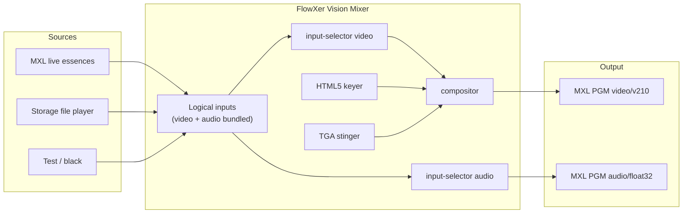

# FlowXer

DMF **Vision Mixer** microservice for the [EBU Dynamic Media Facility](https://tech.ebu.ch/dmf/ra) Media eXchange Layer ([dmf-mxl/mxl](https://github.com/dmf-mxl/mxl)).

The mixer is controlled over HTTP, publishes **OpenAPI** at `/docs`, and keeps media **uncompressed** on the MXL domain:

| Essence | MXL media type | GStreamer caps |
|---------|----------------|----------------|
| Video (VP210 / v210) | `video/v210` | `video/x-raw,format=v210` |
| Audio | `audio/float32` | `audio/x-raw,format=F32LE,rate=48000` |

The media plane is **GStreamer**. FastAPI is the control plane; logical sources, HTML5 keyer, file player, and MXL `mxlsrc` / `mxlsink` when the SDK plugin is present.



## What it does

- **Logical inputs** virtually bundle a video essence and an audio essence into one mixer source (camera, clip, replay, test, black).
- **Storage access** plays files from `storage/clips` (`.mp4`, `.ts`, `.mov`, `.mxf`, …) as uncompressed v210 + float32.
- **HTML5 graphics overlay** keys a page over program (`cefsrc` when installed, Pillow fallback otherwise). A sample lower-third is served at `/graphics/lower-third.html`.
- **Stingers** play a **TGA sequence with alpha** or a **video file**. At the cut frame the mixer switches Program, then finishes the sting. A source can be assigned an auto-stinger so Take/Cut plays that slot; otherwise Wipe arms the next Cut.
- **Tally / UMD** sends TSL UMD Protocol 5.0 (UDP, or TCP with DLE/STX) to receivers such as Bitfocus Companion, Lawo VSM, BFE Commander, and Riedel HI. Program = right-hand red, Preview = left-hand green, label = source name.
- Runs in **Docker** (`vision-mixer` + `gui` services) with a shared MXL domain volume.

## Operator GUI

The GUI is a **separate React service** (Vite + TypeScript) so the mixer container stays a media function. It talks to the mixer API and shows live pictures over **WebRTC WHEP** (JPEG snapshots if WebRTC is unavailable). Source tiles, Preview, and Program show the **same logical source picture** (the DMF essence on that bus) — not three separate generators. **Black** is a black frame. Every control on the console is an HTTP call; there is no hidden GUI-only mixer path.

```
┌─ File  Settings  Tally  Help ─ [CPU% RAM% format] ──────────┐
│  PREVIEW (WebRTC)          PROGRAM (WebRTC)                 │
│  DSK 1 ON/OFF   Stinger ⚙                                   │
│                                                             │
│  [Name ⚙] [Name ⚙] …     source tiles (16:9 or 9:16)        │
│  left of picture = PVW · right of picture = PGM             │
│                          Cut  Fade  Fade to Black  Wipe     │
└─────────────────────────────────────────────────────────────┘
```

**File** takes the mixer on-air (`POST /mixer/start`) or off-air (`POST /mixer/stop`).

**Settings → Console layout…** (`PUT /workspace`) configure:

- video format (1080p50, 720p50, 2160p50, … uncompressed v210) — mixer must be off-air
- **source tiles** 16:9 landscape or 9:16 portrait (display only; can change while on-air; does not change the mixer raster)
- how many logical sources, mixer panels (MEs), stinger slots, and downstream keyers
- stingers: same media for in and out, or separate in/out

The gear on each **source** (`PATCH /inputs/{id}`) sets name, kind, MXL flow UUIDs, clip, and **Auto stinger** — which slot plays when that source is taken to Program or Cut from Preview. Other sources stay hard cuts. Kind **black** is a black video frame (not a test card).

The gear on each **stinger** (`PATCH /stinger-slots/{id}`) picks a TGA sequence or video and **Cut at (frame)**. Pressing the stinger chip plays that slot with `flip_flop` so Preview becomes Program (`POST /stinger/play`).

**Tally → Receivers…** (`PUT /tally/receivers`) adds TSL UMD 5.0 listeners: **Bitfocus Companion**, **Lawo VSM**, **BFE Commander**, **Riedel HI**, or a custom host. Program lights the right-hand lamp red, Preview the left-hand lamp green, and the source name is the UMD label. Display INDEX is the source slot plus an optional offset. Receivers can be changed while on-air.

**Cut / Fade / Fade to Black / Wipe** on the transition bank map to `/mixer/cut`, `/mixer/fade`, `/mixer/fade-to-black`, and `/mixer/wipe`. Wipe arms the next Cut when the Preview source has no auto-stinger.

The top-right **status chip** is a compact CPU / RAM / format pill. Click it for mixer state, load averages, memory, raster, WebRTC, uptime, PID, and issues (`GET /console` or `GET /resources`).

**Help** opens Mixer OpenAPI (`/docs`, proxied from the GUI) and the EBU MXL SDK.

| | |
|--|--|
| Operator GUI | http://localhost:9620 |
| Mixer API / OpenAPI | http://localhost:9610/docs |

```bash
cd gui && npm install && npm run dev   # proxies /api, /docs, /openapi.json to :9610
```

## API

| | |
|--|--|
| Operator GUI | http://localhost:9620 |
| Mixer landing | http://localhost:9610 |
| Swagger UI | http://localhost:9610/docs |
| ReDoc | http://localhost:9610/redoc |
| OpenAPI JSON | http://localhost:9610/openapi.json |

The operator GUI is a client of `/api/v1`. Every console action has a matching route:

| Console action | API |
|----------------|-----|
| Poll layout, buses, resources | `GET /console` |
| File → mixer on-air / off-air | `POST /mixer/start`, `POST /mixer/stop` |
| Settings → Console layout… | `PUT /workspace` (`source_tile_aspect` is display-only and may change on-air) |
| Source left click (PVW) | `POST /mixer/preview` |
| Source right click (PGM) | `POST /mixer/take` |
| Source ⚙ (name, kind, clip, auto-stinger) | `PATCH /inputs/{id}` (`stinger_slot_id`) |
| DSK ON/OFF | `PATCH /keyers/{id}` (`enabled`) |
| Stinger chip (Preview → Program) | `POST /stinger/play` (`flip_flop: true`, `panel_id`) |
| Stinger ⚙ (media, cut frame) | `PATCH /stinger-slots/{id}` (`cut_frame`) |
| Cut / Fade / Fade to Black / Wipe | `POST /mixer/cut`, `/fade`, `/fade-to-black`, `/wipe` |
| Tally → Receivers… | `PUT /tally/receivers` |
| Tally send now | `POST /tally/refresh` |
| Preview pictures | `POST /webrtc/whep/{stream_id}` or `GET /preview/jpeg/{stream_id}` |

API-only (no GUI control yet): `GET /health`, `/config`, `/domain`, `/domain/flows`; `POST`/`DELETE /inputs`; `GET /mixer`; `GET`/`POST /overlay` (legacy overlay vs per-keyer PATCH); `GET /storage/clips` and `/storage/stingers`; `POST /replay/load`, `/replay/take`, `/replay/return`; `POST /stinger/tick` (tests / simulate). The GUI loads a clip through `PATCH /inputs/{id}` `file_path` rather than `/replay/load`. DSK URL / title / subtitle are on `PATCH /keyers/{id}` but the console only toggles enabled.

Useful calls:

```bash
# Start the mixer (publishes deterministic PGM flow UUIDs)
curl -X POST http://localhost:9610/api/v1/mixer/start \
  -H 'content-type: application/json' \
  -d '{"program_input_id":"cam-1","overlay_enabled":true}'

# Bundle a live MXL camera as one logical input
curl -X POST http://localhost:9610/api/v1/inputs \
  -H 'content-type: application/json' \
  -d '{
    "id":"studio-a",
    "label":"Studio A",
    "kind":"mxl_live",
    "video":{"flow_id":"5fbec3b1-1b0f-417d-9059-8b94a47197ed","media_type":"video/v210"},
    "audio":{"flow_id":"b3bb5be7-9fe9-4324-a5bb-4c70e1084449","media_type":"audio/float32","channels":2}
  }'

# 9:16 source tiles (works while on-air); auto-stinger on a camera
curl -X PUT http://localhost:9610/api/v1/workspace \
  -H 'content-type: application/json' -d '{"source_tile_aspect":"9:16"}'
curl -X PATCH http://localhost:9610/api/v1/inputs/cam-1 \
  -H 'content-type: application/json' -d '{"stinger_slot_id":"shared-1"}'

# Cut Preview to Program through a stinger (same as pressing a stinger chip)
curl -X POST http://localhost:9610/api/v1/stinger/play \
  -H 'content-type: application/json' \
  -d '{"stinger_id":"replay-wipe","target_input_id":"cam-2","direction":"to_live","flip_flop":true,"panel_id":"me-1"}'

# Load a clip and stinger into replay, then return to live
curl -X POST http://localhost:9610/api/v1/replay/load \
  -H 'content-type: application/json' -d '{"file_path":"sizzle.ts"}'
curl -X POST http://localhost:9610/api/v1/replay/take \
  -H 'content-type: application/json' -d '{"stinger_id":"replay-wipe"}'
curl -X POST http://localhost:9610/api/v1/replay/return \
  -H 'content-type: application/json' -d '{"stinger_id":"replay-wipe"}'

# TSL 5.0 tally/UMD to Riedel HI (same shape for Companion, VSM, BFE)
curl -X PUT http://localhost:9610/api/v1/tally/receivers \
  -H 'content-type: application/json' \
  -d '{"receivers":[{"id":"hi-1","kind":"hi","label":"Riedel HI","host":"10.0.0.40","port":8900,"transport":"udp","enabled":true,"screen":0,"index_offset":0}]}'
```

Register live MXL inputs **before** starting the mixer. Essence `media_type` is constrained to `video/v210` (or `video/v210a`) and `audio/float32`.

## Docker

```bash
mkdir -p storage/clips
# optional: copy a clip next to the mixer
# cp /path/to/sizzle.ts storage/clips/

docker compose up --build
```

Services:

- **gui** on port **9620** — operator console (WebRTC monitors, PVW/PGM, transitions, tally, settings)
- **vision-mixer** on port **9610** — control API, OpenAPI, WHEP previews
- tmpfs MXL domain at `/mxl-domain`
- bind-mount `./storage` for clips, TGA stingers, overlay cache
- GStreamer path: `videotestsrc` / `filesrc` → `input-selector` → compositor → **v210** / **F32LE**

### Real MXL I/O

Build or copy the [MXL SDK](https://github.com/dmf-mxl/mxl) GStreamer plugin (`libgstmxl.so` + `libmxl.so`) into `/opt/mxl` and the mixer will switch `fakesink` for `mxlsink` / `mxlsrc` automatically.

Point `FLOWXER_MXL_DOMAIN` at the host directory that holds the domain (for example `/Volumes/mxl/domain_1`) to share it with other GStreamer processes.

HTML5 keying in production uses [`gstcefsrc`](https://github.com/centricular/gstcefsrc). Without it, FlowXer still keys a generated lower-third PNG and will load any URL you set once `cefsrc` is on `GST_PLUGIN_PATH`.

## Local development

```bash
python3 -m venv .venv
source .venv/bin/activate
pip install -e '.[dev]'
pytest
FLOWXER_SIMULATE=true FLOWXER_STORAGE_ROOT=./storage FLOWXER_MXL_DOMAIN=./data/mxl-domain \
  uvicorn flowxer.app:create_app --factory --port 9610
```

## Stinger convention

Each stinger slot can use a **TGA sequence** or a **video file**, and has a **cut frame** — the moment Program switches while the sting covers the picture. The GUI field is **Cut at (frame)** (`cut_frame`); `cut_ms` is stored alongside for the mixer clock.

Place sequences under `storage/stingers/<id>/`:

```
frame_00000.tga
frame_00001.tga
...
stinger.json   # { "kind": "sequence", "frame_count", "cut_frame", "cut_ms", "pattern": "frame_%05d.tga" }
```

Video stingers live in the same tree (`kind: "video"` plus `media_path`).

Triggering:

- **Stinger chip** — `POST /stinger/play` with `flip_flop: true` so Preview becomes Program at the cut frame.
- **Auto stinger** — set `stinger_slot_id` on a logical input. Take to Program (or Cut while that source is on Preview) plays that slot.
- **Wipe then Cut** — arms the default stinger for the next Cut when the Preview source has no auto-stinger.

Generate the bundled wipe with:

```bash
python scripts/generate_stinger.py --dest storage/stingers/replay-wipe
```

## Tally and UMD (TSL 5.0)

FlowXer is a TSL UMD Protocol 5.0 **sender**. Each configured receiver gets one packet per bus or label change:

- **UDP** (default, TSL port **8900**) — raw packet
- **TCP** — DLE `0xFE` / STX `0x02` wrapper with DLE stuffing

| TSL field | FlowXer |
|-----------|---------|
| SCREEN | per-receiver `screen` (default 0) |
| INDEX | logical source `slot` + `index_offset` |
| TEXT | source label (ASCII UMD) |
| RH tally | Program = red |
| LH tally | Preview = green |
| Text tally | Program red, Preview green, both amber |

Presets: Bitfocus Companion, Lawo VSM, BFE Commander, Riedel HI (human interface Broadcast Controller), or Custom.

## License

Apache-2.0 for the FlowXer source (same family as MXL). See `LICENSE` and the
copyright appendix, plus `NOTICE` for third-party attribution.

The mixer **source** stays Apache-2.0. Docker images install GStreamer and
FFmpeg/libav, which remain LGPL (and, for some `gst-plugins-bad` bits, mixed
upstream licenses). Shipping the container does **not** turn FlowXer into GPL.
Keep `LICENSE` and `NOTICE` with any binary or image distribution.

The operator GUI (`gui/`) is also Apache-2.0; React and Vite are MIT.

## Public / staging access

The HTTP control plane can start, stop, and take sources on-air. Do not put
an unauthenticated mixer on a public address.

1. Set `FLOWXER_API_TOKEN` in `.env` (see `.env.example`). Health checks stay
   open; `/docs`, OpenAPI, and `/api/v1/*` require `Authorization: Bearer …`
   or `X-FlowXer-Token`.
2. Publish only the GUI (`9620`). Compose binds the mixer API to
   `127.0.0.1:9610`. The GUI nginx (and Vite dev proxy) inject the token.
3. Optional: set `FLOWXER_CORS_ORIGINS` to the GUI origin if a browser talks
   to the mixer port directly.

Making the **GitHub repository** public is a GitHub setting
(Settings → General → Danger zone). This tree does not change visibility.

## Branches and releases

FlowXer uses three long-lived branches. Version numbers are **(merges to main).(promotions to stage).(pushes to dev)** and live in `VERSION`.

```
dev  →  stage  →  main
code     test       container
```

| Branch | What you do | Automation |
|--------|-------------|------------|
| **dev** | Write code. Open PRs into `dev`. | Push increments the **patch** (code) counter. Tests run on the PR (`ci.yml`). |
| **stage** | Merge `dev` → `stage` when a slice is ready to verify. | Push increments the **minor** (stage) counter, runs pytest + typecheck, **builds containers without publishing**, and starts a **Cursor cloud agent** if `CURSOR_API_KEY` is set. Then merges `stage` back into `dev` so `VERSION` stays aligned. |
| **main** | **Manually** merge `stage` → `main` when you want a release. | Push increments the **major** (main) counter, tags `vX.Y.Z`, publishes `ghcr.io/<owner>/flowxer-vision-mixer` and `flowxer-gui`, then merges `main` → `stage` → `dev`. |

Example: `1.4.12` means 1 production release, 4 stage promotions, 12 coding pushes since the counters started.

Before bumping, each version job **reconciles** `VERSION` to the component-wise max of `origin/main`, `origin/stage`, and `origin/dev`, then increments the counter for that branch. That keeps the triple monotonic even if a branch was behind.

Do not merge `dev` straight to `main`. Stage is the test gate; main is the container release.

### Branch protection (required)

This repository has no GitHub branch protection yet. Configure it under **Settings → Rules → Rulesets** (or **Settings → Branches**) so the workflow cannot be skipped:

| Branch | Rules |
|--------|--------|
| **main** | Require a pull request. Require the `CI / Pytest` check. Do not allow force pushes or deletions. Restrict who can push to admins / the merge queue. |
| **stage** | Same as `main`. PRs should come from `dev`. |
| **dev** | Require a pull request. Require `CI / Pytest`. Do not allow force pushes or deletions. |

Without these rules, a direct push to `main` still publishes GHCR images.

### Cursor environment on stage

Cloud Agent setup lives in `.cursor/environment.json` (install script + mixer/GUI terminals). Commit that file; do not rely on a personal dashboard environment.

Two options for the **stage test agent** (pick one; both are valid):

1. **GitHub Actions secret `CURSOR_API_KEY`** — Settings → Secrets and variables → Actions. `stage.yml` calls `https://api.cursor.com/v1/agents` with `startingRef: stage`. Create the key at [cursor.com/dashboard](https://cursor.com/dashboard) → Integrations / Cloud Agents API.
2. **Cursor Automation** — [cursor.com/automations](https://cursor.com/automations), trigger **Push to branch: `stage`**. Prompt is in `.cursor/automations/stage-test.md`.

Rebuilding a Cursor *environment snapshot* on every stage push is the wrong lever (that snapshot is for agent VM setup). The automation/agent **uses** that environment to run the tests.
