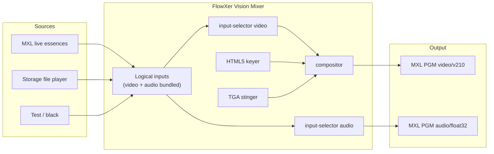

# FlowXer

DMF **Vision Mixer** microservice for the [EBU Dynamic Media Facility](https://tech.ebu.ch/dmf/ra) Media eXchange Layer ([dmf-mxl/mxl](https://github.com/dmf-mxl/mxl)).

The mixer is controlled over HTTP. OpenAPI lives at `/docs` on the **GUI origin** (port **9620**). Media stays **uncompressed** on the MXL domain:

| Essence | MXL media type | GStreamer caps |
|---------|----------------|----------------|
| Video (VP210 / v210) | `video/v210` | `video/x-raw,format=v210` |
| Audio | `audio/float32` | `audio/x-raw,format=F32LE,rate=48000` |

The media plane is **GStreamer**. FastAPI is the control plane; logical sources, HTML5 keyer, file player, and MXL `mxlsrc` / `mxlsink` when the SDK plugin is present.


```mermaid
flowchart LR
    subgraph Sources
      LiveMXL["MXL live essences"]
      FilePlayer["Storage file player"]
      TestGen["Test / black"]
    end

    subgraph VisionMixer["FlowXer Vision Mixer"]
      Logical["Logical inputs\n(video + audio bundled)"]
      VSel["input-selector video"]
      ASel["input-selector audio"]
      HTML5["HTML5 keyer"]
      Stinger["TGA stinger"]
      Comp["compositor"]
    end

    subgraph Output
      PgmV["MXL PGM video/v210"]
      PgmA["MXL PGM audio/float32"]
    end

    LiveMXL --> Logical
    FilePlayer --> Logical
    TestGen --> Logical
    Logical --> VSel
    Logical --> ASel
    VSel --> Comp
    HTML5 --> Comp
    Stinger --> Comp
    Comp --> PgmV
    ASel --> PgmA
```

## What it does

- **Logical inputs** virtually bundle a video essence and an audio essence into one mixer source (camera, clip, replay, test, black).
- **Storage access** plays files from `storage/clips` (`.mp4`, `.ts`, `.mov`, `.mxf`, …) as uncompressed v210 + float32.
- **HTML5 graphics overlay** keys a page over program (`cefsrc` in the mixer image, Pillow fallback if that plugin did not load). A sample lower-third is served at `/graphics/lower-third.html`.
- **Stingers** play a **TGA sequence with alpha** or a **video file**. At the cut frame the mixer switches Program, then finishes the sting. A source can be assigned an auto-stinger so Take/Cut plays that slot; otherwise Wipe arms the next Cut.
- **Tally / UMD** sends TSL UMD Protocol 5.0 (UDP, or TCP with DLE/STX) to receivers such as Bitfocus Companion, Lawo VSM, BFE Commander, and Riedel HI. Program = right-hand red, Preview = left-hand green, label = source name.
- Runs in **Docker** (`vision-mixer` + `gui` services) with a shared MXL domain volume.

## Operator GUI

The GUI is a **separate React service** (Vite + TypeScript) so the mixer container stays a media function. It talks to the mixer API and shows live pictures over **WebRTC WHEP** (JPEG snapshots if WebRTC is unavailable). Source tiles, Preview, and Program show the **same logical source picture** (the DMF essence on that bus) — not three separate generators. **Black** is a black frame. Every control on the console is an HTTP call; there is no hidden GUI-only mixer path.

```
┌─ File  Settings  Tally  Help ─ [CPU% RAM% format] ──────────┐
│  PREVIEW (WebRTC)          PROGRAM (WebRTC)                 │
│  DSK 1 ON/OFF   Stinger ⚙                                   │
│                                                             │
│  [Name ⚙] [Name ⚙] …     source tiles (16:9 or 9:16)        │
│  left of picture = PVW · right of picture = PGM             │
│                          Cut  Fade  Fade to Black  Wipe     │
└─────────────────────────────────────────────────────────────┘
```

**File** takes the mixer on-air (`POST /mixer/start`) or off-air (`POST /mixer/stop`).

**Settings → Console layout…** (`PUT /workspace`) configure:

- video format (1080p50, 720p50, 2160p50, … uncompressed v210) — mixer must be off-air
- **source tiles** 16:9 landscape or 9:16 portrait (display only; can change while on-air; does not change the mixer raster)
- how many logical sources, mixer panels (MEs), stinger slots, and downstream keyers
- stingers: same media for in and out, or separate in/out

The gear on each **source** (`PATCH /inputs/{id}`) sets name, kind, MXL flow UUIDs, clip, and **Auto stinger** — which slot plays when that source is taken to Program or Cut from Preview. Other sources stay hard cuts. Kind **black** is a black video frame (not a test card).

The gear on each **stinger** (`PATCH /stinger-slots/{id}`) picks a TGA sequence or video and **Cut at (frame)**. Pressing the stinger chip plays that slot with `flip_flop` so Preview becomes Program (`POST /stinger/play`).

**Tally → Receivers…** (`PUT /tally/receivers`) adds TSL UMD 5.0 listeners: **Bitfocus Companion**, **Lawo VSM**, **BFE Commander**, **Riedel HI**, or a custom host. Program lights the right-hand lamp red, Preview the left-hand lamp green, and the source name is the UMD label. Display INDEX is the source slot plus an optional offset. Receivers can be changed while on-air.

**Cut / Fade / Fade to Black / Wipe** on the transition bank map to `/mixer/cut`, `/mixer/fade`, `/mixer/fade-to-black`, and `/mixer/wipe`. Fade and Fade to Black dissolve picture and sound over `duration_ms` (default 400 and 600 ms; `POST /mixer/take` with `transition: mix` uses its `duration_ms`, default 400). A Cut during a Fade ends it at once. Wipe arms the next Cut when the Preview source has no auto-stinger.

The top-right **status chip** is a compact CPU / RAM / format pill. Click it for mixer state, load averages, memory, raster, WebRTC, uptime, PID, and issues (`GET /console` or `GET /resources`).

**Help** opens Mixer OpenAPI (`/docs` on the GUI origin) and the EBU MXL SDK.

| | |
|--|--|
| Operator GUI | http://localhost:9620 |
| Mixer API / OpenAPI | http://localhost:9620/docs |

```bash
cd gui && npm install && npm run dev   # proxies /api, /docs, /openapi.json to the mixer on loopback :9610
```

## API

Compose and staging publish **one** HTTP port: the operator GUI on **9620**. Nginx there proxies `/api`, `/docs`, `/redoc`, and `/openapi.json` to the mixer. The mixer listens on **9610** on the Docker network and on **127.0.0.1:9610** on the host — not on a public interface.

| | |
|--|--|
| Operator GUI | http://localhost:9620 |
| Swagger UI | http://localhost:9620/docs |
| ReDoc | http://localhost:9620/redoc |
| OpenAPI JSON | http://localhost:9620/openapi.json |
| Mixer API | http://localhost:9620/api/v1/… |
| Mixer on the host (loopback) | http://127.0.0.1:9610 |

If `FLOWXER_API_TOKEN` is set, calls to **9610** need `Authorization: Bearer …` or `X-FlowXer-Token`. Calls through **9620** do not: nginx (and the Vite dev proxy) inject the token. `/api/v1/health` stays unauthenticated on both.

The operator GUI is a client of `/api/v1`. Every console action has a matching route:

| Console action | API |
|----------------|-----|
| Poll layout, buses, resources | `GET /console` |
| File → mixer on-air / off-air | `POST /mixer/start`, `POST /mixer/stop` |
| Settings → Console layout… | `PUT /workspace` (`source_tile_aspect` is display-only and may change on-air) |
| Source left click (PVW) | `POST /mixer/preview` |
| Source right click (PGM) | `POST /mixer/take` |
| Source ⚙ (name, kind, clip, auto-stinger) | `PATCH /inputs/{id}` (`stinger_slot_id`) |
| DSK ON/OFF | `PATCH /keyers/{id}` (`enabled`) |
| Stinger chip (Preview → Program) | `POST /stinger/play` (`flip_flop: true`, `panel_id`) |
| Stinger ⚙ (media, cut frame) | `PATCH /stinger-slots/{id}` (`cut_frame`) |
| Cut / Fade / Fade to Black / Wipe | `POST /mixer/cut`, `/fade`, `/fade-to-black`, `/wipe` |
| Tally → Receivers… | `PUT /tally/receivers` |
| Tally send now | `POST /tally/refresh` |
| Preview pictures | `POST /webrtc/whep/{stream_id}` or `GET /preview/jpeg/{stream_id}` |
| NMOS (IS-04/IS-05) | Node API on **3252** — see [docs/nmos.md](docs/nmos.md) |

API-only (no GUI control yet): `GET /health`, `/config`, `/domain`, `/domain/flows`; `GET /config/export`, `POST /config/import`; `POST`/`DELETE /inputs`; `GET /mixer`; `GET`/`POST /overlay` (legacy overlay vs per-keyer PATCH); `GET /storage/clips` and `/storage/stingers`; `POST /replay/load`, `/replay/take`, `/replay/return`; `POST /stinger/tick` (tests / simulate). The GUI loads a clip through `PATCH /inputs/{id}` `file_path` rather than `/replay/load`. DSK URL / title / subtitle are on `PATCH /keyers/{id}` but the console only toggles enabled.

Useful calls (through the GUI proxy on **9620**; mixer `:9610` is loopback-only):

```bash
curl http://localhost:9620/api/v1/health
# OpenAPI: http://localhost:9620/docs

# Start the mixer (publishes deterministic PGM flow UUIDs)
curl -X POST http://localhost:9620/api/v1/mixer/start \
  -H 'content-type: application/json' \
  -d '{"program_input_id":"cam-1","overlay_enabled":true}'

# Bundle a live MXL camera as one logical input
curl -X POST http://localhost:9620/api/v1/inputs \
  -H 'content-type: application/json' \
  -d '{
    "id":"studio-a",
    "label":"Studio A",
    "kind":"mxl_live",
    "video":{"flow_id":"5fbec3b1-1b0f-417d-9059-8b94a47197ed","media_type":"video/v210"},
    "audio":{"flow_id":"b3bb5be7-9fe9-4324-a5bb-4c70e1084449","media_type":"audio/float32","channels":2}
  }'

# 9:16 source tiles (works while on-air); auto-stinger on a camera
curl -X PUT http://localhost:9620/api/v1/workspace \
  -H 'content-type: application/json' -d '{"source_tile_aspect":"9:16"}'
curl -X PATCH http://localhost:9620/api/v1/inputs/cam-1 \
  -H 'content-type: application/json' -d '{"stinger_slot_id":"shared-1"}'

# Cut Preview to Program through a stinger (same as pressing a stinger chip)
curl -X POST http://localhost:9620/api/v1/stinger/play \
  -H 'content-type: application/json' \
  -d '{"stinger_id":"replay-wipe","target_input_id":"cam-2","direction":"to_live","flip_flop":true,"panel_id":"me-1"}'

# Load a clip and stinger into replay, then return to live
curl -X POST http://localhost:9620/api/v1/replay/load \
  -H 'content-type: application/json' -d '{"file_path":"sizzle.ts"}'
curl -X POST http://localhost:9620/api/v1/replay/take \
  -H 'content-type: application/json' -d '{"stinger_id":"replay-wipe"}'
curl -X POST http://localhost:9620/api/v1/replay/return \
  -H 'content-type: application/json' -d '{"stinger_id":"replay-wipe"}'

# TSL 5.0 tally/UMD to Riedel HI (same shape for Companion, VSM, BFE)
curl -X PUT http://localhost:9620/api/v1/tally/receivers \
  -H 'content-type: application/json' \
  -d '{"receivers":[{"id":"hi-1","kind":"hi","label":"Riedel HI","host":"10.0.0.40","port":8900,"transport":"udp","enabled":true,"screen":0,"index_offset":0}]}'
```

Register live MXL inputs **before** starting the mixer. Essence `media_type` is constrained to `video/v210` (or `video/v210a`) and `audio/float32`.

## Docker

Compose pulls the images published from `main` to GHCR (`latest`, or set `FLOWXER_IMAGE_TAG`).

```bash
mkdir -p storage/clips
# optional: copy a clip next to the mixer
# cp /path/to/sizzle.ts storage/clips/

docker compose pull
docker compose up
```

Images:

- `ghcr.io/firesh0ot/flowxer-vision-mixer`
- `ghcr.io/firesh0ot/flowxer-gui`

Tags: `{version}`, `latest`, and immutable `git-<sha>` (full commit). Packages should be **public** (GitHub → Packages → package → Package settings → Change visibility → Public). If a pull is still denied, `docker login ghcr.io`. To run a source tree instead of the published images, `docker build` the Dockerfiles yourself — Compose no longer builds.

The mixer and GUI images run as **uid/gid 1000**. Host mounts (`/Volumes/mxl`, `./storage`) must be writable by that user.

Services:

- **gui** on port **9620** — operator console, mixer API (`/api/v1`), and OpenAPI (`/docs`, `/redoc`, `/openapi.json`). Upstream is `FLOWXER_MIXER_URL` (Compose default `http://vision-mixer:9610`; host-network / Kubernetes `http://127.0.0.1:9610`).
- **vision-mixer** on **127.0.0.1:9610** — mixer process. `FLOWXER_HOST` defaults to `127.0.0.1` (safe under `hostNetwork`); bridge Compose sets `0.0.0.0` so the GUI container can reach it.
- tmpfs MXL root (Compose still mounts `/mxl-domain` and sets the deprecated `FLOWXER_MXL_DOMAIN` alias so local demos keep a single-domain layout)
- bind-mount `./storage` for clips, TGA stingers, overlay cache
- GStreamer path: `videotestsrc` / `filesrc` → `tee` → `input-selector` A (Program) and B (incoming source of a Fade) → compositor (with the keyer, and a new pad for each stinger playback) → **v210**; audio the same way through an `audiomixer` → **F32LE**. An MXL audio flow with more channels than Program gives Program its first channels (no downmix).

### Real MXL I/O and HTML keyer

The mixer image builds these from source. You do not compile them yourself:

- [MXL](https://github.com/dmf-mxl/mxl) `release/v1.1` at commit `218ddaa0a08c12ffe75fc475ae65aa3d9eef16d7` (same pin as mxl-fabrics-agent; gst-mxl-rs is compatible with tag `v1.1.0`) — `libmxl` plus `mxlsrc` / `mxlsink` (`/opt/mxl`). Image label `io.dmf.mxl.revision` and `GET /api/v1/health` `mxl_revision` record the pin.
- [`gstcefsrc`](https://github.com/centricular/gstcefsrc) — `cefsrc` HTML keyer and the CEF runtime (`/opt/gstcef`)

When those plugins load, Program is published as MXL `video/v210` and `audio/float32`, and the HTML overlay uses `cefsrc`. If a plugin is missing, the mixer falls back to `fakesink` and a Pillow lower-third.

Point `FLOWXER_MXL_ROOT` at the host tmpfs that holds one directory per domain (for example `/Volumes/mxl`). FlowXer writes Program into `FLOWXER_MXL_OUTPUT_DOMAIN_DIR` (default `<root>/flowxer-<seed-short>`) and **never** into `mirror-*` directories. `mxlsrc` `domain=` is a filesystem path: the mixer scans `domain_def.json` `id` fields on every resolve, including fabrics mirrors.

`FLOWXER_MXL_DOMAIN` remains a deprecated alias that restores the old single-domain layout (Compose still uses it for local demos). The mixer image no longer bakes a fixed `domain_def.json` id. `FLOWXER_READ_OFFSET_GRAINS` is accepted but ignored: gst-mxl-rs `mxlsrc` has no read-offset property and sits at the live edge.

`cefsrc` starts a private Xvfb when `DISPLAY` is unset, with the sandbox off (`GST_CEF_CHROME_EXTRA_FLAGS`).

## Running on an MXL platform

On a host-network MXL node (RKE2 / Ubuntu 24.04), FlowXer is one NMOS media function: mixer **9610** (loopback), GUI **9620**, Node API **3252**. `FLOWXER_API_TOKEN` is **required**.

Kubernetes (edit the nodeSelector, registry URL, and management IP):

```bash
kubectl apply -f deploy/kubernetes/flowxer.yaml
# optional, needs Prometheus Operator CRDs:
kubectl apply -f deploy/kubernetes/servicemonitor.yaml
```

`deploy/kubernetes/flowxer-pod-network.yaml` is the same function on the pod network with the platform's env names (`MXL_*`, `NMOS_*`, `SHUTDOWN_TIMEOUT_S`): the node announces the pod IP, probes go to `/livez` and `/readyz` on 9610, state lives on a `/config` volume.

Host Compose: `docker compose -f docker-compose.host.yml up` with `/Volumes/mxl` mounted and `FLOWXER_API_TOKEN` set. Both files use **host networking**, uid **1000**, and GUI upstream `http://127.0.0.1:9610`.

### Ports

| Port | Use |
|---|---|
| 9610 | Mixer HTTP (`/api/v1`, `/metrics`, `/livez`, `/readyz`) — bind `127.0.0.1` |
| 9620 | Operator GUI (proxies `/api` to the mixer) |
| 3252 | NMOS Node + Connection API (not behind the API token) |
| 3253 | Reserved (nmos-cpp style WebSocket) |
| 32600–32631 | WebRTC ICE host UDP |

Do not use 8080, 8090, 8095, 8100, 8888/8889, 9100, 3212/3213, 3232/3233, 3242/3243, or 23500–23599 (other media functions).

### Configuration

Settings come from the environment (or a `.env` file). Where a platform name exists it wins over the `FLOWXER_` name; both work. An invalid value stops the process with exit code 78.

| Variable | Default | Notes |
|---|---|---|
| `FLOWXER_HOST` | `127.0.0.1` | Mixer bind. Bridge Compose uses `0.0.0.0`. |
| `FLOWXER_PORT` | `9610` | |
| `FLOWXER_MIXER_URL` | `http://127.0.0.1:9610` | GUI nginx/Vite upstream |
| `FLOWXER_GUI_PORT` | `9620` | |
| `MXL_DOMAIN_SCAN_PATH` / `FLOWXER_MXL_ROOT` | `/Volumes/mxl` | Scan for `domain_def.json` |
| `MXL_OUTPUT_DOMAIN_DIR` / `FLOWXER_MXL_OUTPUT_DOMAIN_DIR` | `<root>/flowxer-<seed-short>` | PGM write path; never `mirror-*`. An existing `domain_def.json` with another id is logged as an error and kept. |
| `MXL_OUTPUT_DOMAIN_ID` / `FLOWXER_MXL_OUTPUT_DOMAIN_ID` | UUIDv5(seed) | |
| `MXL_HISTORY_DURATION` / `FLOWXER_MXL_HISTORY_DURATION_NS` | `200000000` | ns; written to `options.json` when the domain is created |
| `MXL_CLEANUP_ON_EXIT` / `FLOWXER_MXL_CLEANUP_ON_EXIT` | `false` | Remove the own output domain on SIGTERM (only when its id matches; never the root or a mirror) |
| `FLOWXER_NMOS_ENABLE` | `true` | `false` keeps REST-only behaviour |
| `NMOS_SEED` / `FLOWXER_NMOS_SEED` | `{hostname}-flowxer` | Stable UUIDv5 IDs |
| `NMOS_LABEL` / `FLOWXER_NMOS_LABEL` | `FLOWXER_TITLE` | Node and device label |
| `NMOS_TAGS` / `FLOWXER_NMOS_TAGS` | `{}` | JSON object of tag → string array, on the node and the device |
| `NMOS_PORT` / `FLOWXER_NMOS_PORT` | `3252` | |
| `NMOS_HOST_ADDRESS` / `FLOWXER_NMOS_HOST_IP` | first non-loopback | Node `href` / `api.endpoints` (an IP address) |
| `NMOS_REGISTRY_ADDRESS`, `NMOS_REGISTRY_PORT` | empty | Registration API; or the full URL in `FLOWXER_NMOS_REGISTRY_URL` (e.g. `http://10.0.0.5:3210`) |
| `NMOS_DNS_SD` / `FLOWXER_NMOS_DNS_SD` | `false` | Not implemented; `true` only logs a warning |
| `FLOWXER_STATE_DIR` | `/config` | Saved state, see below |
| `SHUTDOWN_TIMEOUT_S` / `FLOWXER_SHUTDOWN_TIMEOUT_S` | `10` | Open requests get half; the rest is for stopping media and deregistering |
| `FLOWXER_WEBRTC_PUBLIC_IP` | `FLOWXER_NMOS_HOST_IP` | ICE host candidate |
| `FLOWXER_WEBRTC_UDP_PORT_MIN/MAX` | `32600` / `32631` | |
| `FLOWXER_MONITOR_FPS` | `10` | GUI monitor pictures (JPEG and WebRTC) taken from the pipeline per second; `0` draws generated cards |
| `FLOWXER_API_TOKEN` | empty | **Required on the platform** |
| `FLOWXER_MXL_REVISION` | image pin `218ddaa` | Also `io.dmf.mxl.revision` |

### Saved state, export and import

The mixer saves its configuration to `FLOWXER_STATE_DIR/state.json` after every successful change through the API and after every IS-05 activation, and loads it on start: inputs, console layout, mixer panels, downstream keyers, stinger slots, tally receivers and the receiver connections. Mount `/config` to keep it across restarts. A file that cannot be read is logged and ignored (the mixer starts with defaults).

`GET /api/v1/config/export` returns the same document; `POST /api/v1/config/import` restores it (409 while the mixer is on-air, 422 when it is invalid). It holds no secrets: the API token only comes from the environment.

### Exit codes

| Code | Meaning |
|---|---|
| 1 | Start-up failed (see the log) |
| 75 | The mixer or NMOS port cannot be bound |
| 78 | Invalid configuration (the message names the setting) or an unusable output domain |
| 143 | Stopped by SIGTERM: media stopped, node deregistered, own domain removed with `MXL_CLEANUP_ON_EXIT` |

`/readyz` is 200 only when the MXL root is readable, the output domain is writable and, with a registry configured, the node is registered (heartbeat within 12 s).

See [docs/nmos.md](docs/nmos.md) for receivers/senders and REST ↔ IS-05.

### Route a camera to input 1, take it to program, route program out

Patch a live input so it has NMOS receivers, then IS-05-activate. Replace UUIDs with values from `GET http://<host>:3252/x-nmos/node/v1.3/receivers` and `.../senders`.

```bash
# Make Camera 1 an MXL live input (creates two BCP-007-03 receivers).
curl -sS -X PATCH http://127.0.0.1:9620/api/v1/inputs/cam-1 \
  -H 'content-type: application/json' \
  -d '{"kind":"mxl_live","label":"Camera 1","group_hint":"cam-1"}'

# List receivers (video + audio).
curl -sS http://127.0.0.1:3252/x-nmos/node/v1.3/receivers

# Route an mxl-decklink sender onto Camera 1 video (Qvest does this over IS-05;
# curl equivalent). Accept even if the flow is not on disk yet (state waiting).
RX=$(curl -sS http://127.0.0.1:3252/x-nmos/connection/v1.2/single/receivers | python3 -c "import json,sys; print(json.load(sys.stdin)[0])")
curl -sS -X PATCH "http://127.0.0.1:3252/x-nmos/connection/v1.2/single/receivers/${RX}/staged" \
  -H 'content-type: application/json' \
  -d '{"sender_id":"<DECKLINK_SENDER_UUID>","master_enable":true,"activation":{"mode":"activate_immediate"},"transport_params":[{"mxl_domain_id":"<DOMAIN_UUID>","mxl_flow_id":"<FLOW_UUID>"}]}'

curl -sS -X POST http://127.0.0.1:9620/api/v1/mixer/start \
  -H 'content-type: application/json' \
  -d '{"program_input_id":"cam-1"}'

# Take Camera 1 to Program (already on PGM if started that way).
curl -sS -X POST http://127.0.0.1:9620/api/v1/mixer/take \
  -H 'content-type: application/json' \
  -d '{"input_id":"cam-1","panel_id":"me-1","transition":"cut"}'

# Route FlowXer PGM to an mxl-decklink output receiver: set that receiver's
# IS-05 active params to FlowXer's sender mxl_domain_id / mxl_flow_id.
curl -sS http://127.0.0.1:3252/x-nmos/connection/v1.2/single/senders
```

AMWA NMOS Testing Tool (non-interactive, `amwa/nmos-testing` image):

```bash
bash scripts/nmos-testing.sh http://127.0.0.1:3252
# optional MXL suite:
NMOS_TESTING_SUITES=IS-04-01,IS-05-01,IS-05-02,BCP-007-03-01 \
  bash scripts/nmos-testing.sh http://127.0.0.1:3252
```

GitHub Actions runs the `nmos-testing` job on **PRs into `stage` or `main`** (dev→stage and stage→main) and on every **Stage** workflow after pytest. Manual: **Actions → CI → Run workflow**. `continue-on-error` so IS-04-01 DNS-SD / events WebSocket gaps do not block the promotion; JUnit XML is uploaded as an artifact. Grafana: `deploy/grafana/flowxer.json`.

## Local development

```bash
python3 -m venv .venv
source .venv/bin/activate
pip install -e '.[dev]'
pytest
FLOWXER_SIMULATE=true FLOWXER_STORAGE_ROOT=./storage FLOWXER_MXL_ROOT=./data/mxl-domain \
  uvicorn flowxer.app:create_app --factory --port 9610
```

Mixer OpenAPI on that process is `http://127.0.0.1:9610/docs`. Start the GUI in another terminal so the browser uses **9620** (console, `/docs`, and `/api` proxied to the mixer):

```bash
cd gui && npm run dev
```

## Stinger convention

Each stinger slot can use a **TGA sequence** or a **video file**, and has a **cut frame** — the moment Program switches while the sting covers the picture. The GUI field is **Cut at (frame)** (`cut_frame`); `cut_ms` is stored alongside for the mixer clock. Every playback decodes the stinger again on its own compositor pad, and Program switches when the cut frame reaches the compositor.

Place sequences under `storage/stingers/<id>/`:

```
frame_00000.tga
frame_00001.tga
...
stinger.json   # { "kind": "sequence", "frame_count", "cut_frame", "cut_ms", "pattern": "frame_%05d.tga" }
```

Video stingers live in the same tree (`kind: "video"` plus `media_path`).

Triggering:

- **Stinger chip** — `POST /stinger/play` with `flip_flop: true` so Preview becomes Program at the cut frame.
- **Auto stinger** — set `stinger_slot_id` on a logical input. Take to Program (or Cut while that source is on Preview) plays that slot.
- **Wipe then Cut** — arms the default stinger for the next Cut when the Preview source has no auto-stinger.

Generate the bundled wipe with:

```bash
python scripts/generate_stinger.py --dest storage/stingers/replay-wipe
```

## Tally and UMD (TSL 5.0)

FlowXer is a TSL UMD Protocol 5.0 **sender**. Each configured receiver gets one packet per bus or label change:

- **UDP** (default, TSL port **8900**) — raw packet
- **TCP** — DLE `0xFE` / STX `0x02` wrapper with DLE stuffing

| TSL field | FlowXer |
|-----------|---------|
| SCREEN | per-receiver `screen` (default 0) |
| INDEX | logical source `slot` + `index_offset` |
| TEXT | source label (ASCII UMD) |
| RH tally | Program = red |
| LH tally | Preview = green |
| Text tally | Program red, Preview green, both amber |

Presets: Bitfocus Companion, Lawo VSM, BFE Commander, Riedel HI (human interface Broadcast Controller), or Custom.

## License

Apache-2.0 for the FlowXer source (same family as MXL). See `LICENSE` and the
copyright appendix, plus `NOTICE` for third-party attribution.

The mixer **source** stays Apache-2.0. Docker images install GStreamer and
FFmpeg/libav, which remain LGPL (and, for some `gst-plugins-bad` bits, mixed
upstream licenses). Shipping the container does **not** turn FlowXer into GPL.
Keep `LICENSE` and `NOTICE` with any binary or image distribution.

The operator GUI (`gui/`) is also Apache-2.0; React and Vite are MIT.

## Public / staging access

The HTTP control plane can start, stop, and take sources on-air. Do not put
an unauthenticated mixer on a public address.

1. Set `FLOWXER_API_TOKEN` in `.env` (see `.env.example`).
2. Open the console at `http://<host>:9620` and docs at `http://<host>:9620/docs`.
   API calls are `http://<host>:9620/api/v1/…`. Compose binds the mixer to
   `127.0.0.1:9610` only; nginx injects the token so the browser does not send it.
3. Health stays open at `/api/v1/health`. Direct calls to loopback **9610** still
   need `Authorization: Bearer …` (or `X-FlowXer-Token`) when the token is set.

## Branches and releases

FlowXer uses three long-lived branches. Version numbers are **(merges to main).(promotions to stage).(pushes to dev)** and live in `VERSION`.

```
dev  →  stage  →  main
code     test       container
```

| Branch | What you do | Automation |
|--------|-------------|------------|
| **dev** | Write code. Open PRs into `dev`. | Push increments the **patch** (code) counter. Tests run on the PR (`ci.yml`). |
| **stage** | Merge `dev` → `stage` when a slice is ready to verify. | Push increments the **minor** (stage) counter, runs pytest + typecheck, **AMWA NMOS testing** (`continue-on-error`), **builds containers without publishing**, and starts a **Cursor cloud agent** if `CURSOR_API_KEY` is set. Then merges `stage` back into `dev` so `VERSION` stays aligned. |
| **main** | **Manually** merge `stage` → `main` when you want a release. | Push increments the **major** (main) counter, tags `vX.Y.Z`, publishes `ghcr.io/<owner>/flowxer-vision-mixer` and `flowxer-gui`, then merges `main` → `stage` → `dev`. |

Example: `1.4.12` means 1 production release, 4 stage promotions, 12 coding pushes since the counters started.

Before bumping, each version job **reconciles** `VERSION` to the component-wise max of `origin/main`, `origin/stage`, and `origin/dev`, then increments the counter for that branch. That keeps the triple monotonic even if a branch was behind.

Do not merge `dev` straight to `main`. Stage is the test gate; main is the container release.

### Branch protection (required)

This repository has no GitHub branch protection yet. Configure it under **Settings → Rules → Rulesets** (or **Settings → Branches**) so the workflow cannot be skipped:

| Branch | Rules |
|--------|--------|
| **main** | Require a pull request. Require the `CI / Pytest` check. Do not allow force pushes or deletions. Restrict who can push to admins / the merge queue. |
| **stage** | Same as `main`. PRs should come from `dev`. |
| **dev** | Require a pull request. Require `CI / Pytest`. Do not allow force pushes or deletions. |

Without these rules, a direct push to `main` still publishes GHCR images.

### Cursor environment on stage

Cloud Agent setup lives in `.cursor/environment.json` (install script + mixer/GUI terminals). Commit that file; do not rely on a personal dashboard environment.

Two options for the **stage test agent** (pick one; both are valid):

1. **GitHub Actions secret `CURSOR_API_KEY`** — Settings → Secrets and variables → Actions. `stage.yml` calls `https://api.cursor.com/v1/agents` with `startingRef: stage`. Create the key at [cursor.com/dashboard](https://cursor.com/dashboard) → Integrations / Cloud Agents API.
2. **Cursor Automation** — [cursor.com/automations](https://cursor.com/automations), trigger **Push to branch: `stage`**. Prompt is in `.cursor/automations/stage-test.md`.

Rebuilding a Cursor *environment snapshot* on every stage push is the wrong lever (that snapshot is for agent VM setup). The automation/agent **uses** that environment to run the tests.
